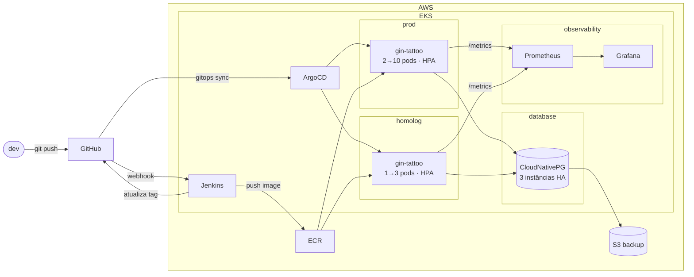
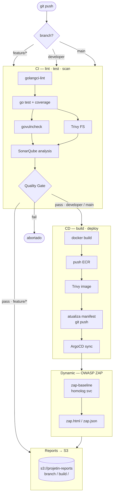

# aws-devops

Infraestrutura para o [gin-tattoo](https://github.com/sant125/gin-tattoo) — REST API em Go/Gin sobre estilos e curiosidades de tatuagem, rodando em EKS com GitOps e observabilidade completa.

---

## Arquitetura



## Pipeline CI/CD



---

## Stack

| Camada | Tecnologia |
|--------|-----------|
| App | Go 1.22 + Gin, `/metrics` (Golden Signals), `/health`, Swagger |
| Infra | Terraform — VPC, EKS 1.31, Karpenter (Spot + OD), ECR, S3 |
| CI/CD | Jenkins in-cluster (JCasC, Multibranch) → ArgoCD (App-of-Apps) |
| Banco | CloudNativePG — 3 instâncias HA, backup S3 |
| Observability | kube-prometheus-stack — Prometheus, Grafana (RED dashboard), AlertManager |
| Secrets | Bitnami SealedSecrets |
| Segurança | golangci-lint, govulncheck, OWASP ZAP, Trivy, SonarQube |

---

## Decisões

**Karpenter** foi escolhido no lugar de Managed Node Groups porque consolida nós ociosos automaticamente e diversifica tipos de instância em segundos — o Cluster Autoscaler não faz nem um nem outro direito. O custo é ter mais CRDs pra operar e uma curva de aprendizado maior.

**CloudNativePG** resolve o problema de custo: RDS Multi-AZ em db.t3.medium já passa de $90/mês antes de contar storage, enquanto três instâncias CNPG no cluster custam basicamente só o EBS (~$1,60/mês por 20Gi). O trade-off real é operacional — vacuum, patch e failover são sua responsabilidade. Vale pra esse contexto; em ambiente com equipe pequena e sem SRE dedicado, RDS faria mais sentido.

**Homolog e prod compartilham o mesmo cluster Postgres** via schemas distintos. Reduz custo e complexidade, mas o isolamento é menor — um erro de scope numa query de homolog pode afetar prod se as credenciais não forem mantidas separadas. Os SealedSecrets por namespace mitigam mas não eliminam.

**Jenkins rodando dentro do cluster** evita o custo de minutos do GitHub Actions e usa os próprios nós como agentes de build. A contrapartida é que você passa a operar o Jenkins: updates, plugins quebrando, PVC que não pode perder. Para um time que já conhece Kubernetes, o custo operacional é baixo. Para um time pequeno sem essa familiaridade, GitHub Actions com self-hosted runners provavelmente seria mais fácil de manter.

**SealedSecrets** foi a escolha mais simples dado que não há outro sistema usando SSM ou Vault. O cluster funciona offline, sem dependência de serviço externo. A rotação de um secret exige reselar e abrir PR — aceitável nessa escala, mas começa a doer com muitos secrets rotacionando com frequência.

**Subnets públicas** eliminam ~$130/mês por AZ em NAT Gateway. Os pods ficam com IP público, mas o acesso é controlado pelos Security Groups do EKS. Para compliance ou PCI isso não passa — subnets privadas seriam obrigatórias.

---

## Como subir

Veja [docs/BOOTSTRAP.md](docs/BOOTSTRAP.md) para o guia completo.

```bash
# TL;DR
terraform -chdir=terraform init && terraform -chdir=terraform apply
kubectl apply -f argocd/root-app.yaml
```

## Estrutura

```
.
├── terraform/               # VPC, EKS, Karpenter, ECR, S3
├── manifests/
│   ├── database/            # CloudNativePG cluster (3 instâncias)
│   ├── gin-tattoo-homolog/  # Deployment, HPA, ServiceMonitor
│   ├── gin-tattoo-prod/     # Deployment, HPA, ServiceMonitor
│   ├── jenkins/             # Helm values + JCasC
│   ├── sonarqube/           # Helm values
│   ├── karpenter/           # NodePool + EC2NodeClass
│   └── observability/       # kube-prometheus-stack values, dashboard, alertas
├── argocd/                  # root app + Applications individuais
└── docs/
    ├── BOOTSTRAP.md
    └── diagrams/
```
